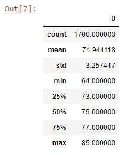
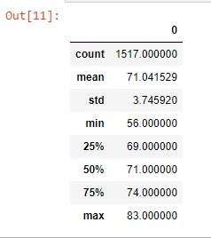

# surfs-up

## Overview

### Purpose

The purpose of this analysis is to assess weather data taken from Oahu in order to assess the feasiblity of starting a surf and shake shop on the island.  This analysis will make use of historical weather data stored in a SQLite database that will require reading and interpeting with the help of Python.

## Results

* For the month of June, the data indicate a range of 64.0 °F to 85.0 °F with a median of 75.0 °F, a mean value of 74.9 °F, and a standard deviation of 3.26 °F.  The inner quartile range is 4.00 °F in magnitude.

    
* For the month of December, the data indicate a range of 56.0 °F to 83.0 °F with a median of 71.0 °F, a mean of 71.0 °F, and a standard dviation of 3.75 °F.  The inner quartile range is 5.00 °F in magnitude.

    
* From both data sets the mean and the median are nearly equivalent, indicating that the data sets lack skewness.

## Summary

### Discussion

From the data, the similarities between the inner quartile ranges indicate that the typical distribution of temperatures between the two seasons is consistent.  The observed shift between the two seasons suggests that the weather will remain fairly constant while fluctuating only about 4.0 °F on average.  Overall, the temperature data for Oahu indicate that the weather is quite nice all year round.

### Proposed Queries

Given that demand for ice cream is most likely to be enjoyed in warmer weather, one set of queries to help determine where on Oahu to locate the store would be to determine which weather station consistently has the highest temperatures on average for June and December:

results = session.query(Measurement.tobs,Measurement.station).\
    filter(Measurement.tobs >= 72).\
    filter(extract('month',Measurement.date)==6)

results = session.query(Measurement.tobs,Measurement.station).\
    filter(Measurement.tobs >= 72).\
    filter(extract('month',Measurement.date)==12)

Each of these queries can then be imported into a DataFrame and get the count of which station has the highest count of days higher than 72 °F.

Those queries can be followed up with a similar set of queries to determine which stations have the most days with zero rainfall in both months:

results = session.query(Measurement.prcp,Measurement.station).\
    filter(Measurement.prcp == 0).\
    filter(extract('month',Measurement.date)==6)

results = session.query(Measurement.prcp,Measurement.station).\
    filter(Measurement.prcp == 0).\
    filter(extract('month',Measurement.date)==12)

Similarly, analysis after importing to a DataFrame will aid in determining which stations have the most days with zero rainfall.  Finding the stations with the highest temperatures and the lowest rainfall will help in determining the ideal location for the store.